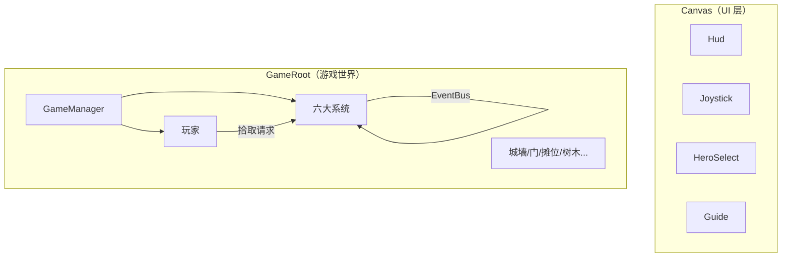

# Main 场景装配说明（审阅版）

> **状态**：待确认。确认后使用 MCP 按 `SceneAssemblySpec.ts` 执行装载。  
> **场景文件**：`assets/scenes/Main.scene`  
> **设计分辨率**：720 × 1280（竖屏）

---

## 一、总体分层



| 层级 | 根节点 | Layer | 说明 |
|------|--------|-------|------|
| UI | `Canvas` | UI_2D | 摇杆、HUD、英雄选择、引导文字 |
| 世界 | `GameRoot` | DEFAULT | 玩家、怪物、摊位、城墙、树木 |

---

## 二、节点树（完整目标）

```
Main
├── Canvas
│   ├── Camera
│   └── UI
│       ├── Hud                 ← 右上：背景 + 图标 + 数值
│       │   ├── MeatBg / MeatIcon / MeatLabel
│       │   └── CoinBg / CoinIcon / CoinLabel
│       ├── Joystick            ← 全屏触区 + VirtualJoystick
│       │   ├── Hint            ← 固定右下提示摇杆
│       │   │   └── HintStickRoot (Bg, Thumb, FingerIcon, FingerAnim)
│       │   └── StickRoot       ← 触屏落点操作摇杆 (Bg, Thumb)
│       ├── HeroSelect          ← 英雄二选一（默认隐藏）
│       └── Guide               ← 新手引导文案
│
└── GameRoot                    ← GameManager
    ├── Systems
    │   ├── Combat              ← DefenseCombatSystem
    │   ├── Economy             ← ResourceEconomySystem
    │   ├── NpcAi               ← NpcAiSystem
    │   ├── Shop                ← ShopSystem
    │   └── SceneTiles          ← SceneTileSystem
    │
    ├── Player                  ← PlayerController + PlayerCarryStack + 物理
    │   ├── Visual              ← 渲染子节点 + SortingOrder2D
    │   └── CarryRoot           ← 背负堆叠起点
    │
    └── World
        ├── Drops               ← 地面掉落物父节点
        ├── Npcs                ← 帮手/伐木工父节点
        ├── EnemySpawner        ← 刷怪（玩家首次移动后开始）
        │   └── SpawnPoints/*
        ├── Wall                ← 城墙血量 + 碰撞
        ├── Gate                ← 靠近开门
        ├── City                ← 初始城内
        │   ├── Stalls/Stall_RawMeat
        │   ├── Deposits/Deposit_RawMeat, Deposit_Coin
        │   ├── Towers/Tower_South
        │   └── Purchases/BuyHelper
        ├── ExpandEast          ← 默认隐藏，购买后显示
        └── ExpandWest
```

---

## 三、组件挂载清单

### 3.1 系统节点（必挂）

| 节点路径 | 组件 | 脚本路径 |
|----------|------|----------|
| `GameRoot` | GameManager | `scripts/GameManager.ts` |
| `GameRoot/Systems/Combat` | DefenseCombatSystem | `scripts/combat/DefenseCombatSystem.ts` |
| `GameRoot/Systems/Economy` | ResourceEconomySystem | `scripts/economy/ResourceEconomySystem.ts` |
| `GameRoot/Systems/NpcAi` | NpcAiSystem | `scripts/npc/NpcAiSystem.ts` |
| `GameRoot/Systems/Shop` | ShopSystem | `scripts/shop/ShopSystem.ts` |
| `GameRoot/Systems/SceneTiles` | SceneTileSystem | `scripts/scene/SceneTileSystem.ts` |

### 3.2 玩家

| 节点路径 | 组件 | 说明 |
|----------|------|------|
| `GameRoot/Player` | PlayerController | 摇杆移动、地面/箭塔状态 |
| `GameRoot/Player` | PlayerCarryStack | 背负金币/肉/木 |
| `GameRoot/Player` | RigidBody2D | Type=Dynamic, Gravity=0 |
| `GameRoot/Player` | BoxCollider2D | 玩家碰撞体 |
| `GameRoot/Player/Visual` | SortingOrder2D | 渲染在子节点 |

### 3.3 世界实体

| 节点路径 | 组件 | 说明 |
|----------|------|------|
| `World/EnemySpawner` | EnemySpawner | 上限 30，首次移动后刷新 |
| `World/Wall` | Wall + BoxCollider2D | 血条、受击闪白 |
| `World/Gate` | Gate | 靠近开门 |
| `City/Towers/Tower_South` | ArrowTower | 南方初始箭塔 |
| `City/Stalls/Stall_RawMeat` | Stall + CustomerQueue | 生肉摊位 |
| `City/Deposits/*` | DepositPoint | 生肉 6 槽 / 金币 4 槽 |
| `Expand*/Trees/*` | TreeEntity + TreeChopTrigger | 砍 5 次消失 |
| `City/*/BuildTrigger` 等 | PurchaseTrigger | 购买 UI 触发区 |

### 3.4 UI

| 节点路径 | 组件 | 说明 |
|----------|------|------|
| `Canvas/UI/Hud` | HudResourceUI | 金币、肉数量 |
| `Canvas/UI/Joystick` | VirtualJoystick | 双 StickRoot：Hint / StickRoot |
| `Canvas/UI/HeroSelect` | HeroSelectUI | 二选一，默认 inactive |
| `Canvas/UI/Guide` | TutorialGuide | 引导阶段文案 |

---

## 四、引用绑定（审阅重点）

### 4.1 GameManager

| 属性 | 指向 |
|------|------|
| player | `GameRoot/Player` → PlayerController |
| combat | `GameRoot/Systems/Combat` → DefenseCombatSystem |
| economy | `GameRoot/Systems/Economy` → ResourceEconomySystem |
| npcAi | `GameRoot/Systems/NpcAi` → NpcAiSystem |
| shop | `GameRoot/Systems/Shop` → ShopSystem |
| sceneTiles | `GameRoot/Systems/SceneTiles` → SceneTileSystem |
| guide | `Canvas/UI/Guide` → TutorialGuide |

### 4.2 PlayerController

| 属性 | 指向 |
|------|------|
| joystick | `Canvas/UI/Joystick` → VirtualJoystick |
| carryStack | `GameRoot/Player` → PlayerCarryStack |
| visualNode | `GameRoot/Player/Visual` |

### 4.3 DefenseCombatSystem

| 属性 | 指向 |
|------|------|
| spawner | `World/EnemySpawner` → EnemySpawner |
| player | `GameRoot/Player` → PlayerController |
| heroRoot | `World/City/Towers` |
| arrowPrefab | `resources/prefabs/pref_arrow`（占位） |
| heroPrefabs[0..3] | `pref_hero_ice / storm / lightning / rocket` |

### 4.4 ResourceEconomySystem

| 属性 | 指向 |
|------|------|
| playerCarry | `GameRoot/Player` → PlayerCarryStack |
| dropRoot | `World/Drops` |
| deposits[] | City/Deposits 下全部 DepositPoint |
| stalls[] | City/Stalls 下全部 Stall |
| rawMeatPrefab | `pref_meat` |
| woodPrefab | `pref_wood` |
| cookedMeatPrefab | `pref_cooked_meat` |

### 4.5 EnemySpawner

| 属性 | 指向 |
|------|------|
| defaultTarget | `World/Wall` |
| enemyPrefab | `pref_enemy` |
| spawnPoints[] | `SpawnPoints` 下子节点 |

### 4.6 PurchaseTrigger 示例（Tower_South）

| 属性 | 值 |
|------|-----|
| itemType | ArrowTower |
| towerId | `tower_south` |
| priceLabel | 子节点 Label |
| autoPurchase | true |

---

## 五、玩法节点 ID 约定

| 对象 | ID / 命名 | 备注 |
|------|-----------|------|
| 南方箭塔 | `tower_south` | 建造 30 金 |
| 生肉摊位 | `stall_raw` | 绑定帮手 |
| 生肉储肉点 | `tower_south_meat_deposit` 或 `deposit_raw` | 1 摊位 : 1 储肉点 |
| 金币放置点 | `deposit_coin` | 4 槽 |
| 东侧拓展 | ExpandSide.East | 180 金 |
| 西侧拓展 | ExpandSide.West | 180 金 |
| 拓展箭塔 | `tower_east` / `tower_west` | 200 金，建成通关 |

---

## 六、当前场景 vs 目标差异

| 项目 | 当前 Main.scene | MCP 装载后 |
|------|-----------------|------------|
| 骨架节点 | ✅ GameRoot/Systems/World/Player/UI | 保留 |
| 六大系统组件 | ✅ 已挂 | 保留 |
| 核心引用 | ✅ GameManager/Player/Combat 部分已绑 | 补全 |
| City/Stalls/Deposits | ❌ 未创建 | 阶段 2 创建 |
| ExpandEast/West | ❌ 未创建 | 阶段 3 创建 |
| UI 子节点（Label/Sprite） | ❌ 仅空节点 | 阶段 2/4 创建 |
| 预制体引用 | ❌ 空 | 阶段 4 占位预制体 |
| 物理碰撞体 | ❌ 未加 | 阶段 4 |

---

## 七、MCP 装载计划（确认后执行）

1. **阶段 1**：保留现有骨架，校验/补全系统引用  
2. **阶段 2**：城内摊位、放置点、箭塔、购买点、玩家子节点  
3. **阶段 3**：东西拓展区、树木、伐木工购买点  
4. **阶段 4**：占位预制体、RigidBody2D/Collider2D、SortingOrder2D  

详细步骤见：`assets/scripts/scene/SceneAssemblySpec.ts` → `McpLoadPhases`

---

## 八、脚本清单（38 个）

```
core/       Enums, GameConstants, GameEvent, Singleton, SortingOrder2D, FlyTween
player/     VirtualJoystick, PlayerController, PlayerCarryStack, TowerMountTrigger
combat/     Enemy, EnemySpawner, Wall, Gate, Hero, ArrowTower, DefenseCombatSystem
economy/    ResourceEntity, DepositPoint, Stall, Customer, CustomerQueue, ResourceEconomySystem
npc/        HelperNpc, LumberjackNpc, NpcAiSystem
shop/       ShopConfig, ShopSystem, PurchaseTrigger
scene/      TreeEntity, TreeChopTrigger, SceneTileSystem, SceneAssemblySpec
ui/         HudResourceUI, JoystickHintUI, HeroSelectUI, HeroCdUI, TutorialGuide
GameManager.ts
```

---

## 九、请你确认

- [ ] 节点树结构是否符合预期？
- [ ] 六大系统挂载位置是否 OK？
- [ ] 引用绑定关系是否正确？
- [ ] ID 命名（tower_south / stall_raw 等）是否需要调整？
- [ ] MCP 分 4 阶段装载是否可以？

**确认后回复「可以装载」或指出需修改项，我再通过 MCP 写入场景。**
